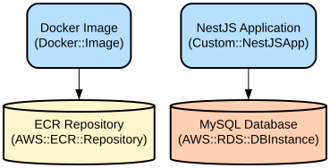

# Multi-Environment Infrastructure as Code with Terraform for Vehicle Management System

This repository contains a comprehensive Infrastructure as Code (IaC) solution using Terraform to deploy and manage a vehicle management system across multiple environments. The system consists of a NestJS backend API, React frontend, and AWS infrastructure components for reliable, scalable, and secure application deployment.

The project implements a complete vehicle management system with features for inventory management, order processing, user management, and vehicle details tracking. It uses a multi-tier architecture with separate frontend and backend services, containerized deployments, and infrastructure automation across development, staging, and production environments.

## Repository Structure
```
.
├── infra/                      # Infrastructure as Code files
│   └── terraform/              # Terraform configurations
│       ├── environments/       # Environment-specific configurations
│       │   ├── dev/           # Development environment
│       │   ├── staging/       # Staging environment
│       │   └── production/    # Production environment
│       └── modules/           # Reusable Terraform modules
│           ├── autoscaling/   # Auto Scaling Group configurations
│           ├── cloudfront/    # CDN distribution setup
│           ├── ecs/          # Container orchestration
│           ├── rds/          # Database configurations
│           └── vpc/          # Network infrastructure
├── src/
│   ├── backend/              # NestJS backend application
│   │   ├── api/             # REST API implementation
│   │   └── lambda/          # AWS Lambda functions
│   └── frontend/            # React frontend application
```

## Usage Instructions
### Prerequisites
- AWS CLI configured with appropriate credentials
- Terraform >= 1.0.0
- Node.js >= 18.x
- Docker >= 20.x
- MySQL >= 8.0

### Installation

1. Clone the repository:
```bash
git clone <repository-url>
cd <repository-name>
```

2. Set up backend:
```bash
cd src/backend/api
npm install
```

3. Set up frontend:
```bash
cd src/frontend
npm install
```

4. Initialize Terraform:
```bash
cd infra/terraform/environments/dev
terraform init
```

### Quick Start
1. Deploy infrastructure:
```bash
# From infra/terraform/environments/dev
terraform plan -out=tfplan
terraform apply tfplan
```

2. Start backend locally:
```bash
cd src/backend/api
npm run start:dev
```

3. Start frontend locally:
```bash
cd src/frontend
npm run dev
```

### More Detailed Examples
1. Deploying to production:
```bash
cd infra/terraform/environments/production
terraform init
terraform plan -var-file=prod.tfvars -out=tfplan
terraform apply tfplan
```

2. Adding a new environment:
```bash
cp -r infra/terraform/environments/dev infra/terraform/environments/new-env
cd infra/terraform/environments/new-env
# Modify terraform.tfvars with new environment values
```

### Troubleshooting
1. Infrastructure Deployment Issues
- Error: "No space left on device"
  - Solution: Clean up unused Docker images and volumes
  ```bash
  docker system prune -af
  ```

2. Database Connection Issues
- Error: "Could not connect to database"
  - Check VPC security groups
  - Verify RDS instance status
  - Validate database credentials in environment variables

3. Container Deployment Issues
- Error: "ECS service unable to start"
  - Check ECS cluster capacity
  - Verify container health checks
  - Review CloudWatch logs for detailed error messages

## Data Flow
The application follows a multi-tier architecture with clear separation of concerns.

```ascii
[Frontend (React)] <--> [CloudFront] <--> [ALB] <--> [ECS Services] <--> [RDS]
                                          ^
                                          |
[S3 Assets] ---------> [CloudFront] ------+
```

Key interactions:
- Frontend makes API calls through CloudFront to ALB
- Backend services run in ECS with auto-scaling
- Database operations are handled through RDS
- Static assets are served through S3 and CloudFront
- Authentication is managed through JWT tokens

## Infrastructure


### VPC Resources
- VPC with public and private subnets
- NAT Gateways for private subnet internet access
- Security groups for service isolation

### Compute Resources
- ECS Clusters for container orchestration
- Auto Scaling Groups for EC2 instances
- Lambda functions for image processing

### Database Resources
- RDS instances for MySQL database
- Read replicas for production environment
- Automated backups and maintenance windows

### Security Resources
- WAF rules for API protection
- IAM roles and policies
- SSL/TLS certificates via ACM

## Deployment
1. Prerequisites:
- AWS credentials configured
- Terraform installed
- Docker installed

2. Deployment Steps:
```bash
# 1. Build application images
cd src/backend/api
docker build -t backend:latest .
cd ../../frontend
docker build -t frontend:latest .

# 2. Push images to ECR
aws ecr get-login-password --region region | docker login --username AWS --password-stdin account.dkr.ecr.region.amazonaws.com
docker tag backend:latest account.dkr.ecr.region.amazonaws.com/backend:latest
docker push account.dkr.ecr.region.amazonaws.com/backend:latest

# 3. Deploy infrastructure
cd infra/terraform/environments/production
terraform init
terraform apply
```